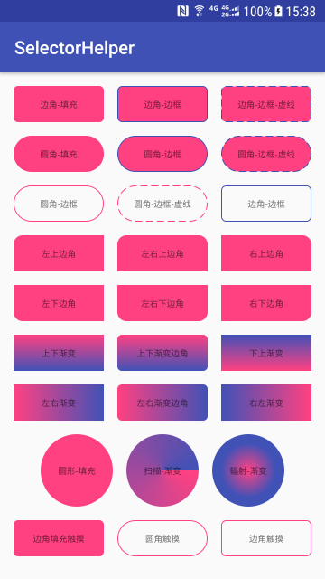
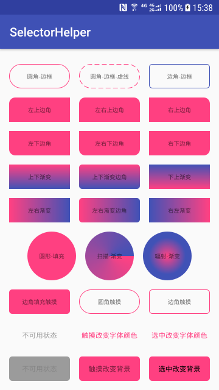

# SelectorHelper

[](https://developer.android.com/)
[](https://android-arsenal.com/api?level=14)
[](https://bintray.com/)

**Android 动态创建 Shape 和 Selector，告别 XML 文件！**

SelectorHelper 是一个轻量级的 Android 工具库，通过链式调用动态创建 GradientDrawable、StateListDrawable 和 ColorStateList，让你无需再编写繁琐的 XML drawable 文件。支持 Shape、Selector、颜色选择器和图片选择器的灵活组合，让 UI 开发更高效。

## 📱 效果预览




## ✨ 特性

- 🔹 **链式调用** - 流畅的 Builder 模式，代码更简洁
- 🔹 **类型丰富** - 支持矩形、圆形、圆角等多种 Shape
- 🔹 **灵活组合** - Shape、Selector、Color、Drawable 自由组合
- 🔹 **渐变支持** - 线性渐变、辐射渐变、扫描渐变
- 🔹 **状态管理** - 轻松处理 pressed、enabled、checked 等状态
- 🔹 **兼容性好** - 支持 AndroidX，最低 API 14

## 📦 安装依赖

在模块的 `build.gradle` 中添加依赖：

```gradle
// 支持 AndroidX（推荐）
implementation 'com.github.VinPin:selectorhelper:2.0.1'

// 不支持 AndroidX（旧版本）
implementation 'com.vinpin:selectorhelper:1.0.0'
```

## 🚀 快速开始
### 1️⃣ 初始化

在自定义 Application 的 `onCreate()` 方法中初始化：

```java
public class MyApplication extends Application {
    @Override
    public void onCreate() {
        super.onCreate();
        // 初始化 SelectorHelper
        SelectorHelper.init(this);
    }
}
```

---

### 2️⃣ 创建 Shape（GradientDrawable）

使用 [`ShapeHelper`](selectorhepler/src/main/java/com/vinpin/selectorhelper/ShapeHelper.java) 动态创建各种形状的 drawable：

#### 基础用法

```java
// 创建带圆角的实心背景
GradientDrawable drawable = ShapeHelper.getInstance()
    .solidColor(R.color.colorAccent)      // 设置填充颜色
    .stroke(dp2px(1), R.color.colorPrimary) // 设置边框
    .cornerRadius(dp2px(5))                // 设置圆角
    .create();
```

#### 更多示例

**矩形圆角边框：**
```java
ShapeHelper.getInstance()
    .solidColor(R.color.colorAccent)
    .stroke(dp2px(1), R.color.colorPrimary, dp2px(8), dp2px(4)) // 虚线边框
    .cornerRadius(dp2px(5))
    .create()
```

**单个圆角设置：**
```java
// 左上角圆角
ShapeHelper.getInstance()
    .solidColor(R.color.colorAccent)
    .tlRadius(dp2px(10))
    .create()

// 右上角圆角
ShapeHelper.getInstance()
    .solidColor(R.color.colorAccent)
    .trRadius(dp2px(10))
    .create()
```

**渐变效果：**
```java
// 上下渐变
ShapeHelper.getInstance()
    .gradient(R.color.colorAccent, R.color.colorPrimary)
    .create()

// 左右渐变
ShapeHelper.getInstance()
    .gradient(ShapeHelper.LEFT_RIGHT, 
              R.color.colorAccent, 
              R.color.colorPrimary)
    .create()

// 辐射渐变
ShapeHelper.getInstance()
    .gradientRadial(dp2px(30), 
                    R.color.colorAccent, 
                    R.color.colorPrimary)
    .create()
```

**圆形：**
```java
// 实心圆形
ShapeHelper.getInstance()
    .shape(GradientDrawable.OVAL)
    .solidColor(R.color.colorAccent)
    .create()

// 扫描渐变圆形
ShapeHelper.getInstance()
    .shape(GradientDrawable.OVAL)
    .gradientSweep(R.color.colorAccent, R.color.colorPrimary)
    .create()
```

> 💡 **提示：** 所有颜色支持两种传入方式
> - 颜色资源 ID：`solidColor(R.color.colorAccent)`
> - 颜色字符串：`solidColor("#FF5722")`

---

### 3️⃣ 创建 ShapeSelector（StateListDrawable）

使用 [`ShapeSelector`](selectorhepler/src/main/java/com/vinpin/selectorhelper/ShapeSelector.java) 创建不同状态下的 shape 组合：

```java
// 按钮按下时改变背景形状
StateListDrawable drawable = SelectorHelper.shapeSelector()
    .pressed(true, ShapeHelper.getInstance()
        .solidColor(R.color.colorPrimary)
        .cornerRadius(dp2px(5))
        .create())
    .defaultShape(ShapeHelper.getInstance()
        .solidColor(R.color.colorAccent)
        .cornerRadius(dp2px(5))
        .create())
    .create();
```

**应用到 View：**
```java
textView.setClickable(true);
textView.setBackground(drawable);
```

> 💡 **提示：** 每个状态方法都支持链式调用，可根据需要组合不同的 state

---

### 4️⃣ 创建 ColorSelector（ColorStateList）

使用 [`ColorSelector`](selectorhepler/src/main/java/com/vinpin/selectorhelper/ColorSelector.java) 创建不同状态下的颜色选择器：

```java
// 根据 enabled 状态改变文字颜色
ColorStateList colorStateList = SelectorHelper.colorSelector()
    .enabled(false, "#9B9B9B")           // 禁用状态颜色
    .defaultColor(R.color.colorAccent)   // 默认颜色
    .create();

textView.setTextColor(colorStateList);
textView.setEnabled(false);
```

**其他状态示例：**
```java
// 按下时改变文字颜色
SelectorHelper.colorSelector()
    .pressed(true, R.color.colorPrimary)
    .defaultColor(R.color.colorAccent)
    .create()

// 选中时改变文字颜色（适用于 CheckBox）
SelectorHelper.colorSelector()
    .checked(true, R.color.colorPrimary)
    .defaultColor(R.color.colorAccent)
    .create()
```

---

### 5️⃣ 创建 DrawableSelector（StateListDrawable）

使用 [`DrawableSelector`](selectorhepler/src/main/java/com/vinpin/selectorhelper/DrawableSelector.java) 创建更复杂的状态组合：

```java
// 根据 enabled 状态改变背景
StateListDrawable drawable = SelectorHelper.drawableSelector()
    .enabled(false, ShapeHelper.getInstance()
        .solidColor("#9B9B9B")
        .cornerRadius(dp2px(5))
        .create())
    .defaultDrawable(ShapeHelper.getInstance()
        .solidColor(R.color.colorAccent)
        .cornerRadius(dp2px(5))
        .create())
    .create();

view.setBackground(drawable);
view.setEnabled(false);
```

**综合示例 - CheckBox 背景：**
```java
CheckBox checkBox = findViewById(R.id.checkBox);
checkBox.setBackground(SelectorHelper.drawableSelector()
    .checked(true, ShapeHelper.getInstance()
        .solidColor(R.color.colorPrimary)
        .cornerRadius(dp2px(5))
        .create())
    .defaultDrawable(ShapeHelper.getInstance()
        .solidColor(R.color.colorAccent)
        .cornerRadius(dp2px(5))
        .create())
    .create());
```

---

## 🎯 API 参考

### ShapeHelper 主要方法

| 方法 | 说明 | 参数 |
|------|------|------|
| `shape(@Shape int shape)` | 设置 Shape 类型 | RECTANGLE, OVAL, LINE, RING |
| `solidColor(...)` | 设置填充颜色 | @ColorRes 或 String |
| `stroke(...)` | 设置边框 | width, color [, dashWidth, dashGap] |
| `cornerRadius(float radius)` | 设置统一圆角 | 半径值 |
| `tlRadius/trRadius/blRadius/brRadius(float radius)` | 设置单个圆角 | 半径值 |
| `gradient(...)` | 设置线性渐变 | orientation, colors |
| `gradientSweep(...)` | 设置扫描渐变 | colors |
| `gradientRadial(...)` | 设置辐射渐变 | centerX, centerY, radius, colors |

### Selector 通用状态方法

| 方法 | 对应 State | 说明 |
|------|-----------|------|
| `pressed(boolean, ...)` | state_pressed | 按下状态 |
| `enabled(boolean, ...)` | state_enabled | 启用状态 |
| `checked(boolean, ...)` | state_checked | 选中状态 |
| `selected(boolean, ...)` | state_selected | 选中状态 |
| `focused(boolean, ...)` | state_focused | 聚焦状态 |
| `activated(boolean, ...)` | state_activated | 激活状态 |
| `defaultShape/Color/Drawable(...)` | - | 默认状态 |

---

## 📝 最佳实践

1. **统一初始化** - 在 Application 中一次性初始化
2. **复用 Helper** - 相同的样式可以封装成工具方法
3. **链式调用** - 保持代码简洁易读
4. **颜色管理** - 推荐使用颜色资源文件，便于主题切换

---

## 🆚 对比传统 XML 方式

**传统 XML 方式：**
```xml
<!-- res/drawable/bg_button.xml -->
<shape xmlns:android="http://schemas.android.com/apk/res/android">
    <solid android:color="@color/colorAccent"/>
    <corners android:radius="5dp"/>
    <stroke 
        android:width="1dp" 
        android:color="@color/colorPrimary"/>
</shape>
```

```java
textView.setBackgroundResource(R.drawable.bg_button);
```

**使用 SelectorHelper：**
```java
textView.setBackground(
    ShapeHelper.getInstance()
        .solidColor(R.color.colorAccent)
        .cornerRadius(dp2px(5))
        .stroke(dp2px(1), R.color.colorPrimary)
        .create()
);
```

**优势：**
- ✅ 减少 XML 文件数量
- ✅ 代码更直观，易于维护
- ✅ 支持动态参数，灵活性更高
- ✅ 链式调用，开发体验更好

---

## 📄 License

```
Copyright © 2018 VinPin

Licensed under the Apache License, Version 2.0 (the "License");
you may not use this file except in compliance with the License.
You may obtain a copy of the License at

    http://www.apache.org/licenses/LICENSE-2.0

Unless required by applicable law or agreed to in writing, software
distributed under the License is distributed on an "AS IS" BASIS,
WITHOUT WARRANTIES OR CONDITIONS OF ANY KIND, either express or implied.
See the License for the specific language governing permissions and
limitations under the License.
```

---

## 🙏 致谢

感谢使用 SelectorHelper！如有问题或建议，欢迎提 [Issue](https://github.com/VinPin/SelectorHelper/issues)。
